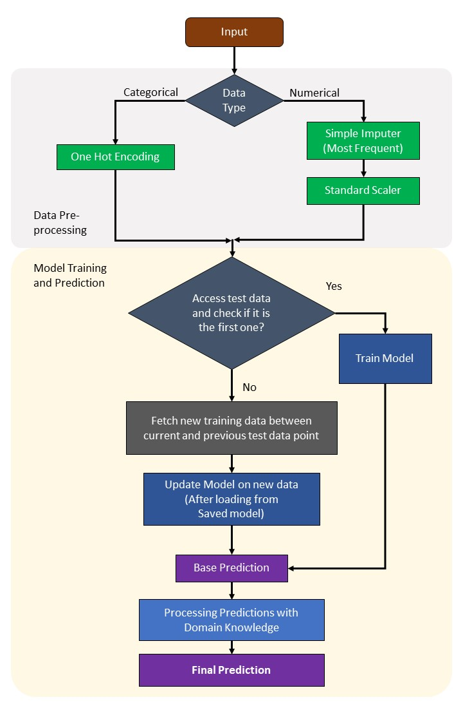

# ML Algorithm Synthesizing Domain Knowledge for Fungal Spores Concentration Prediction
### [Md Asif Bin Syed](https://www.linkedin.com/in/asifbinsyed/), [Azmine Toushik Wasi](https://azminewasi.github.io/), [Imtiaz Ahmed](https://www.linkedin.com/in/imtiazahmedtamuisen/)

---

[](https://azminewasi.github.io/research/paper/qcre2023)
[](https://arxiv.org/abs/2309.13402)
[](https://arxiv.org/pdf/2309.13402.pdf)
[](https://github.com/azminewasi/qcre23-finalist)
[](https://azminewasi.github.io/research/paper/qcre2023/QCRE_slides.pdf)


---


# Dataset Placement

Both the `trainset.xlsx` and `testset.xlsx` files should be placed in the same directory where there `predictions.py` file is placed.

To use data from any other locations, please change the `xlsx_path_train_data` and `xlsx_path_test_data` variables *(can be located at the very begining of both files)* accordingly with respective file locations.

Current file locations are denoted here:

```
xlsx_path_train_data = "trainset.xlsx"
xlsx_path_test_data = "testset.xlsx"
```

---
# Running the Model 

## Running the Model using a .py file

To run the model using the `predictions.py` file, you need to install all the required modules listed in the `requirements.txt` file. You can install these modules by running the following command:

```
pip install -r requirements.txt
```

Once you have installed the necessary modules, you can run the model by executing the following command:

```
python predictions.py
```
---

## Running the Model using an .ipynb file (Jupyter Notebook)

To run the model using the `train.ipynb` Jupyter Notebook file, you first need to install all the required modules listed in the `requirements_ipynb.txt` file. You can install these modules by running the following command:

```
pip install -r requirements_ipynb.txt
```

After installing the modules, you can run the model by opening the `predictions.ipynb` file in Jupyter Notebook and clicking on the "Run All" button or manually running each code cell sequentially.

---
# Model Architecture




---
# Certificate


